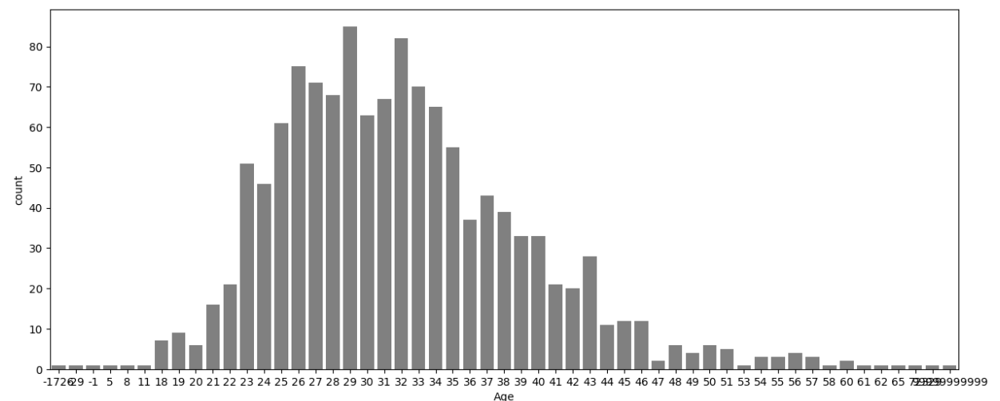

# 🧠 Tech Employee Mental Health - EDA & Feature Engineering


## 📌 Project Overview

This project explores a dataset focused on the **mental health of tech employees**, using data from Kaggle. The primary goal is to understand what factors influence whether a person **seeks treatment** for mental health challenges.

---

## 🔍 The project involves:

- Exploratory Data Analysis (EDA)
- Handling missing values and duplicates
- Univariate, bivariate & multuivariate analysis of features
- Outlier detection and treatment (Age)
- Categorical data cleaning (Gender, Country)
- Feature transformation (e.g., US vs Non-US country)
- Target variable preparation for modeling (treatment column)
- Plans for Machine Learning Modeling (upcoming)

---

## 💼 Purpose

This project is built as part of my **Data Analyst portfolio** to demonstrate real-world data handling, storytelling, and preparation for predictive analytics. It serves both as a **personal learning journey** and a showcase of my **analytical skills**

---

## 📂 Dataset

The dataset is taken from Kaggle:  
**[OSMI Mental Health in Tech Survey](https://www.kaggle.com/datasets/osmi/mental-health-in-tech-survey)**

The dataset includes survey responses from individuals in the tech industry on their experiences with mental health and treatment.

---

## 🧱 Technologies Used

- Python
- Jupyter Notebook
- NumPy, Pandas
- Matplotlib, Seaborn

---

## 🚀 How to Run This Project

1. Clone the repository:
   ```bash
   git clone https://github.com/your-username/tech-employee-mental-health_EDA_FE.git
   
2. Navigate to the project directory:
   ```bash
   cd tech-employee-mental-health_EDA_FE

3. Open the notebook in Jupyter

📝 Both the dataset (survey.csv) and the notebook (.ipynb) file are included in this repo for easy access and reproducibility.

---

## 📊 Visuals & Code Snippets
🔥 Missing Values Heatmap

   
   
      # Handle missing values
      
      feature_with_nan = [feature for feature in df if df[feature].isnull().sum() > 0]
      for feature in feature_with_nan:
          print(f"{feature} has {df[feature].isnull().mean()*100:.2f}% missing values")

    
👤 Gender Distribution After Cleaning

   

      # Clean Gender Column
        
      def clean_gender(val):
       val = str(val).strip().lower()
       if val in ['male', 'm', 'man']:
           return 'male'
       elif val in ['female', 'f', 'woman']:
           return 'female'
       else:
           return 'others'
   
      df['Gender'] = df['Gender'].apply(clean_gender)

After Cleaning

   

📈 Age Distribution After Outlier Removal

   

      # Outlier Handling for Age Feature
      Q1 = df['Age'].quantile(0.25)
      Q3 = df['Age'].quantile(0.75)
      IQR = Q3 - Q1
      df = df[(df['Age'] >= Q1 - 1.5 * IQR) & (df['Age'] <= Q3 + 1.5 * IQR)]

After Outlier Removal

   

---

## 🤝 Contributing

Contributions are welcome! If you have a better approach, cleaner code, or more efficient techniques, feel free to fork the repo and open a pull request. 
Let’s make the project better together.

---

## 📄 License

This project currently does not have a license. You are free to explore and use the content for learning purposes.

---

## 📬 Contact

For collaboration, feedback, or opportunities, feel free to reach out via GitHub or LinkedIn. 
Let’s connect!
